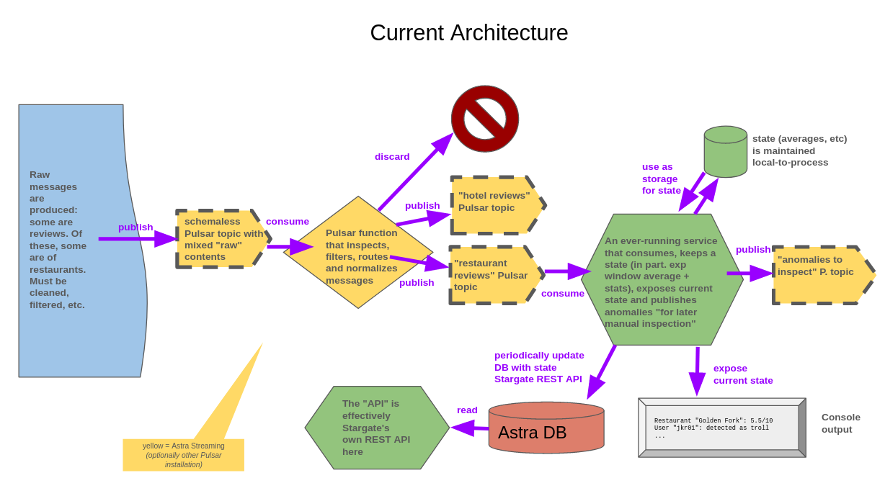
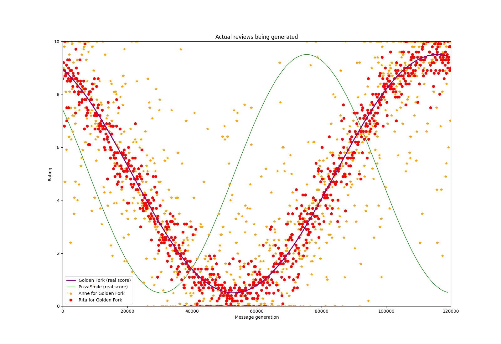
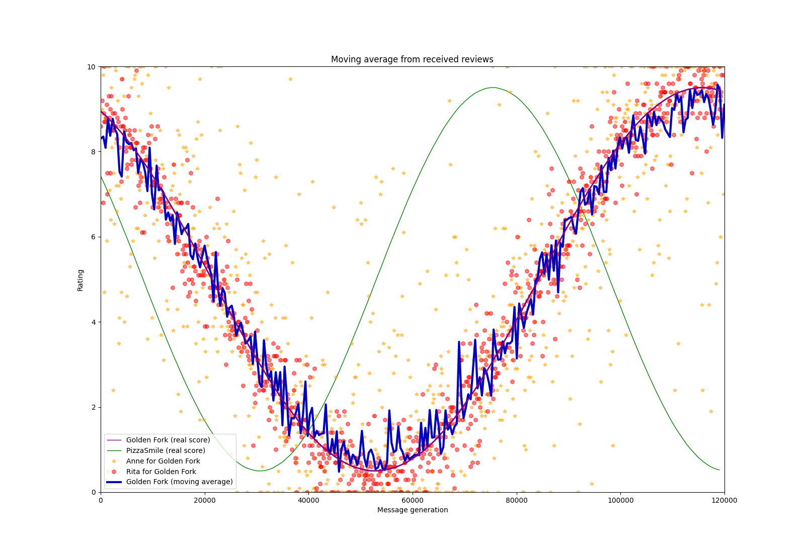

# README

Review Troll Squad. A sample architecture making use of Pulsar and Pulsar
Functions for real-time, event-streaming-based data ingestion, cleaning and processing.

_Reviews of various venues (hotels/restaurants), written by various users, keep pouring in.
We need a way to clean, normalize and filter them, removing trolls
and blatant outliers, and make the results available to the end user._


## The use-case



A stream of "events" (messages), some of which are reviews, is poured into a Pulsar topic for "raw reviews".
A Pulsar function filters out malformed items and those that do not specify
their target type (restaurant/hotel). This function takes care of normalizing the incoming reviews,
since - as is often the case in real life - certain field names in the incoming reviews can have
multiple forms. All reviews are encoded as JSON strings.

The Pulsar function singles out hotel and restaurant reviews and routes them,
after normalizing their structure, to two specific topics. We happen to be interested in restaurants,
so we have a process performing the actual analysis. Heavy artillery, such as ML-trained classifiers
and the like, would be placed here.

The analyzer keeps listening to the restaurant topic and ingests all incoming reviews: it keeps
and update a state with key information, such as a rolling average score per each restaurant.

As new items arrive, they are checked if they are "troll reviews" (review text in heavy disagreement
with the numeric score) and, if so, discarded. Otherwise they enter the rolling average for the
target restaurant.

The analyzer periodically publishes an assessment for users and restaurants to a database, ready to
be queried by any service that may need this data. (The output can also go to console if so desired).
The destination DB also offers a ready-to-use REST API that allows to retrieve its data
with simple HTTP requests, making it easy to build panels and UIs on top of this pipeline.

The analyzer also reroutes "outlier reviews" (scores much different than the current rolling average)
to another Pulsar topic, for a hypothetical manual inspection of such outliers.

### Review generation

There is a pseudorandom procedure to generate reviews with features that fluctuate in a predictable
way: it is all in the `revGenerator` directory.

There is no "time" in the generation: to keep things simple, we use a "sequence index" in place of
time. Also, some of the "reviews" are not even valid JSON strings but contain gibberish instead,
as is often the case in real-life data ingestion pipelines!

Each time a review is created, a venue (target) and a user (reviewer) are chosen at random: then,
score and text are also created according to the following rules:

Each venue has a "true" quality that is slowly oscillating in time, see for example these two restaurants:


Each reviewer has an associate amplitude that dictates how widely the scores they produce
may fluctuate away from the "true" value for that venue at that "time": in this example, the individual
scores emitted by two different reviewers are plotted with a large and a small amplitude:



Also, each reviewer has a "trolliness", a Boolean: if true, then a review text is built in strong
disagreement with the numeric score in the review.

On the **analyzer side**, the reconstructed rolling average roughly follows the "true" quality for
a venue, and is used to detect "outliers": each review that differs too much from the current rolling
average is deemed an outlier. Here the rolling average corresponding to the above restaurant is plotted:




## Setup

A Pulsar instance is needed to provide the streaming infrastructure. This demo
can run both on a standard Pulsar installation or an Astra Streaming instance:
the following instructions will cover both cases.

### Database

An Astra DB instance is required to collect the data for persistence.
What is needed for the Astra DB part is the creation of a DB (preferrably
called `workshops`) and a keyspace in it (called `trollsquad`) as described
[here](https://github.com/datastaxdevs/awesome-astra/wiki/Create-an-AstraDB-Instance).
Then you should create a DB Token (role "API Read/Write User" is sufficient)
as described [here](https://github.com/datastaxdevs/awesome-astra/wiki/Create-an-Astra-Token)
and keep the "Token" value handy.

### Pulsar/Astra Streaming

Choose your path:

#### If you use Astra Streaming

The Streaming creation and retrieval of secrets is described in detail
[here](https://github.com/datastaxdevs/awesome-astra/wiki/Create-an-AstraStreaming-Topic).

Create an Astra Streaming tenant in your Astra Account:
Call it e.g. something like `trollsquad` (beware: tenant names are unique,
pick yours and write it down for later).

Use the `default` namespace in that tenant.

Create (with the Astra UI) the four topics (`persistent=yes`, `partitioned=no`):
`rr-raw-in`, `rr-hotel-reviews`, `rr-restaurant-reviews`
and `rr-restaurant-anomalies`.

Retrieve the Broker Service URL and the Streaming Token (again, see [here](https://github.com/datastaxdevs/awesome-astra/wiki/Create-an-AstraStreaming-Topic#-step-4-retrieve-the-broker-url)).

#### Function:

In the Astra UI, click on your tenant and go to the "Functions" tab.
Hit "Create Function".

**IMPORTANT**: You must now manually edit the tenant name in all entries of the
`DST_TOPIC_MAP` in the Python file before uploading:
**it must reflect your unique tenant name**.

When creating the function through the Astra Streaming UI:

- Name = `rrouter-function`, namespace = `default`;
- upload the `pulsar_routing_function/review_router.py` and pick the `ReviewRouter` function name;
- input topic: `default` and `rr-raw-in`;
- leave output/log topics empty;
- do not touch Advanced Configuration;
- no need for any further option configuration. Hit "Create".

The function will display as "Initializing" in the listing for some time
(20 s perhaps), then "Running". You're all set now.

#### If you use standard Pulsar

We assume in the following a fresh dockerized Pulsar installation, i.e.
obtained with

    docker run -it -p 6650:6650  -p 8080:8080 --mount source=pulsardata,target=/pulsar/data --mount source=pulsarconf,target=/pulsar/conf apachepulsar/pulsar:2.9.1 bin/pulsar standalone

(note that ports 6650 (and 8080) are accessible from outside docker: we are going to take advantage of this fact.)

Spawn a shell on the Pulsar machine:

    docker exec -it $CONTAINER_ID bash

and create the four required topics with
```
mkdir /root/functions   # while we're at it, for later

./bin/pulsar-admin topics list public/default

./bin/pulsar-admin topics create persistent://public/default/rr-raw-in
./bin/pulsar-admin topics create persistent://public/default/rr-hotel-reviews
./bin/pulsar-admin topics create persistent://public/default/rr-restaurant-reviews
./bin/pulsar-admin topics create persistent://public/default/rr-restaurant-anomalies

./bin/pulsar-admin topics list public/default
```

Next, carry the Python file (containing the Pulsar function) to the Docker instance
and install it as a Pulsar function:

    # IN YOUR LOCAL SHELL:
    docker cp pulsar_routing_function/review_router.py $CONTAINER_ID:/root/functions

```
# Back to the Pulsar machine shell
ls /root/functions    # check py file is there

./bin/pulsar-admin functions create \
  --py /root/functions/review_router.py \
  --classname review_router.ReviewRouter \
  --tenant public \
  --namespace default \
  --name rrouter-function \
  --inputs rr-raw-in

./bin/pulsar-admin functions list \
  --tenant public \
  --namespace default
```

(You would delete it with `./bin/pulsar-admin functions delete --tenant public --namespace default --name rrouter-function`).

The Pulsar setup is done.

### Local settings

Now that the Pulsar setup is done, let's turn to local configuration.

Copy the `.env.sample` file to `.env` and edit it:

`PULSAR_MODE` should match whether you use Astra Streaming or standard Pulsar.
In the former case, paste the values you obtained earlier for the streaming
connection/credentials in the `ASTRA_STREAMING_BROKER_URL` and
`ASTRA_STREAMING_TOKEN` variables.
In the latter case (standalone Pulsar, again assuming a simple local dockerized
installation) you are good with inserting the URL to your local Pulsar in
`PULSAR_CLIENT_URL` (probably `docker inspect $CONTAINER_NAME` may help).

Make sure `TENANT` and `NAMESPACE` match your setup (the former is likely
`public` on a local Pulsar and is whatever tenant name you chose if you are
on Astra Streaming; the latter is most likely just `default`).

Unless you got creative with the topic names, those should be all
right as they are.

Next is the Astra DB part: remember the token you created earlier for the DB
and paste it to `ASTRA_DB_APP_TOKEN`, while the values for
`ASTRA_DB_ID`, `ASTRA_DB_REGION` and `ASTRA_DB_KEYSPACE` are all found in the
main dashboard of your Astra UI.

### Python environment

Create a Python 3.6+ virtual environment, install the dependencies
in `requirements.txt` and also add the repo's root directory to the
`PYTHONPATH`. You should be in this virtual environment in all Python commands
you will soon start.


## Running the demo

Everything is now ready to run the demo.

Open three shells next to each other: one will run the review generator,
one will run the analyzer, and the third will consume and display entries
from the "review anomalies" topic.

> The third shell will run a simple utility able to subscribe to a generic
> Pulsar topic and display the items found therein. You can use it to peek
> into the other topics as well. But if you are using Astra Streaming you may
> as well want to explore the "Try Me!" feature available directly in the Web UI,
> which allows to read and write items by hand from/to Astra Streaming topics.

Now start in rapid succession these three commands in the three shells and
enjoy the show:
```
# first shell
./revGenerator/review_generator.py -r 50

# second shell
./revAnalyzer/review_analyzer.py -r -o -f 100

# third shell
./tools/reader.py -t rr-restaurant-anomalies
```

_Note_: you can customize the behaviour of those commands - try passing `-h`
to the scripts to see what is available.

### Querying the database

The only part still to show is reading from the database. You can access
the tables in any way you want, for instance using the
provided [CQL shell on the Astra DB UI](https://github.com/datastaxdevs/awesome-astra/wiki/Cql-Shell):
just inspect the `trollsquad` keyspace and try to `SELECT` rows from the tables you find there.

> You will notice that the restaurant reviews are written in _two_ tables: one will simply
> contain the latest average score for each restaurant, the other is structured to offer
> historical data for e.g. a plotting client application (there is some built-in eviction
> of old results to avoid unbound growth of the table).

_Note:_ you just have to create the keyspace, since every time the analyzer starts
it checks for the tables and, if they do not exist, it creates them for you.

### Astra DB REST API

One of the nice things of Astra DB is that you get various ways to interact
with your database through ordinary HTTP requests, all for free, through
the [Stargate Data API](https://stargate.io/) on top of the underlying database.

The following examples are run with `cURL`, but of course they can be adapted
to any client able to issue simple HTTPS requests.

First source the `.env` file in a shell and create the full base URL for the requests:
```
. .env
ASTRA_URL_ROOT="https://${ASTRA_DB_ID}-${ASTRA_DB_REGION}.apps.astra.datastax.com/api/rest/v1/keyspaces/${ASTRA_DB_KEYSPACE}/tables"
```

then try to run the following commands one by one and wee what the result looks like:

```
curl -X GET \
    "${ASTRA_URL_ROOT}/known_ids_per_type/rows/restaurant" \
    -H "accept: application/json" \
    -H "X-Cassandra-Token: ${ASTRA_DB_APP_TOKEN}" | python -mjson.tool


curl -X GET \
    "${ASTRA_URL_ROOT}/known_ids_per_type/rows/reviewer" \
    -H "accept: application/json" \
    -H "X-Cassandra-Token: ${ASTRA_DB_APP_TOKEN}" | python -mjson.tool


curl -X GET \
    "${ASTRA_URL_ROOT}/restaurants_by_id/rows/vegg00" \
    -H "accept: application/json" \
    -H "X-Cassandra-Token: ${ASTRA_DB_APP_TOKEN}" | python -mjson.tool


curl -X GET \
    "${ASTRA_URL_ROOT}/reviewers_by_id/rows/geri" \
    -H "accept: application/json" \
    -H "X-Cassandra-Token: ${ASTRA_DB_APP_TOKEN}" | python -mjson.tool


curl -X GET \
    "${ASTRA_URL_ROOT}/restaurants_by_id_time/rows/gold_f" \
    -H "accept: application/json" \
    -H "X-Cassandra-Token: ${ASTRA_DB_APP_TOKEN}" | python -mjson.tool
```
